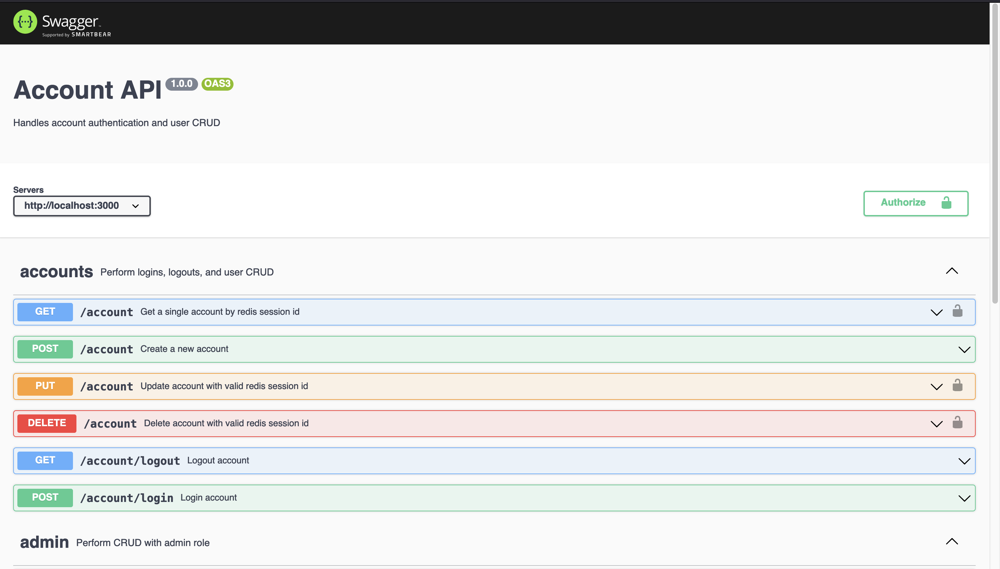
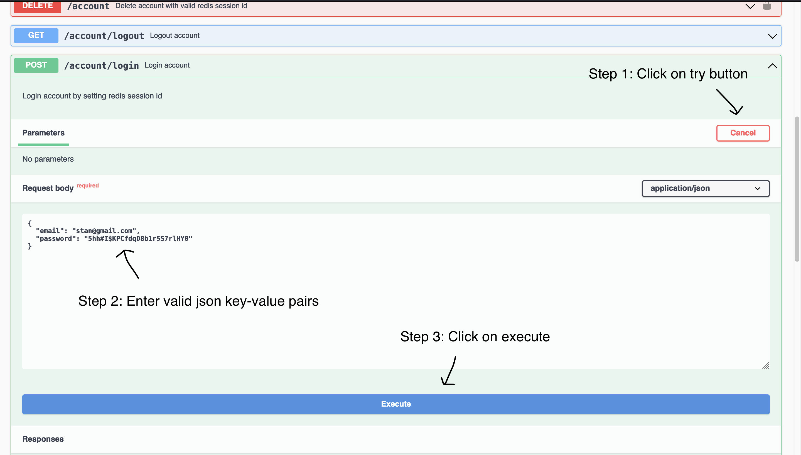

# cinema-account-microservice

<!-- PROJECT LOGO -->
<br />
<p align="center">
  <a href="https://github.com/othneildrew/Best-README-Template">
    
  </a>

  <h3 align="center">Cinema-Account-README</h3>

  <p align="center">
    Responsible for registration, login, logout, and actions associated with accounts.
  </p>
</p>

<!-- TABLE OF CONTENTS -->
<details open="open">
  <summary>Table of Contents</summary>
  <ol>
    <li>
      <a href="#about-the-project">About The Project</a>
    </li>
    <li>
      <a href="#getting-started">Getting Started</a>
      <ul>
        <li><a href="#prerequisites">Prerequisites</a></li>
        <li><a href="#installation">Installation</a></li>
      </ul>
    </li>
    <li><a href="#usage">Usage</a></li>
    <li><a href="#roadmap">Roadmap</a></li>
    <li><a href="#license">License</a></li>
    <li><a href="#acknowledgements">Acknowledgements</a></li>

  </ol>
</details>

<!-- ABOUT THE PROJECT -->

## About The Project

Refer to: https://github.com/leoan96/cinema-microservice

<!-- GETTING STARTED -->

## Getting Started

This is an example of how you may give instructions on setting up your project locally.
To get a local copy up and running follow these simple example steps.

### Prerequisites

This is an example of how to list things you need to use the software and how to install them.

- npm

  ```sh
  npm install npm@latest -g
  ```

- create a free [MongoDB Atlas](https://www.mongodb.com/cloud/atlas) acccount or setup a local MongoDB database
- create a free [CloudKarafka](https://www.cloudkarafka.com/) account or setup a local kafka broker and zookeeper server
- setup a local [Hashicorp Vault]()
- configure secret path, refer to http://taswar.zeytinsoft.com/using-hashicorp-vault-for-nodejs-application-to-store-secrets/ or https://codersociety.com/blog/articles/hashicorp-vault-node
- store your secrets into the secret path (refer to the secrets & environment variables below in the .env file)
- create a .env file
- store secrets & environment variables (the values below are just sample values, please replace them with your own credentials)
- ```sh
  SERVER_PORT=3000
  NODE_ENV=development
  BACKEND_TOKEN=865b0e87c145c61d9c5b4682825f8a026017e03380c310273097989769fb
  MONGO_DATABASE_URI=mongodb+srv://<username>:<password>@cluster0.tihvu.mongodb.net/<database>?authSource=admin&replicaSet=atlas-ltmo8u-shard-0&w=majority&readPreference=primary&appname=MongoDB%20Compass&retryWrites=true&ssl=true
  EXPRESS_SESSION_SECRET=dfc89d6a182025d62ab2ae3485b0497b4cc9397f1ab820fb3b5f3fa99c45
  REDIS_PORT=15136
  REDIS_HOST=redis-15136.c1.ap-southeast-3-5.ec2.cloud.redislabs.com
  REDIS_PASSWORD=26186baa6eb3d6088925571d166564db0a1f3d5931c7386aa0b08a6d6fa8
  APP_BASE_URL=http://localhost:3000
  VAULT_ROLE_ID=7cb37e9e6f22ca2cf84a46e631f09d30238d02fd7fbae5c59101a3a29c68
  VAULT_SECRET_ID=3844670bd95526d1651cc560992087852e1cf055938b506f67b13f9b3f54
  VAULT_API_VERSION=v1
  VAULT_ENDPOINT_URL=http://127.0.0.1:8200
  VAULT_SECRET_PATH=secret/data/development/api-account
  KAFKA_BROKER=kafka-01.srvs.cloudkafka.com:9094,kafka-02.kafka.cloudkafka.com:9094,kafka-03.kafka.cloudkafka.com:9094
  KAFKA_USERNAME=7cdf92b44a1289a49051
  KAFKA_PASSWORD=59d575183a1a358f338c187725303661ca30b307
  ```

### Installation

1. Clone the repo
   ```sh
   git clone https://github.com/leoan96/cinema-account-microservice.git
   ```
2. Install NPM packages
   ```sh
   npm install
   ```
3. Start Hashicorp Vault server (remember to start docker before beginning this step)
   ```sh
   cd vault-backend-storage
   docker-compose -f docker-compose.yml up
   ```
4. Unseal the hashicorp vault
   - visit http://localhost:8200
   - enter 3 of the 5 vault keys
   - enter root token
5. Start server
   ```sh
   npm run start:dev
   ```

<!-- USAGE EXAMPLES -->

## Usage

You can utilize the api endpoints using either Postman or visiting http://localhost:3000/api




To use any endpoints from this or other microservices that require authorization, please use this cinema-account-microservice's login endpoint

_For more examples, please refer to the [Documentation](https://example.com)_

<!-- ROADMAP -->

## Roadmap

TBA

<!-- LICENSE -->

## License

Distributed under the MIT License. See `LICENSE` for more information.

## Acknowledgements

- [TBA](https://github.com/leoan96/cinema-microservice)
